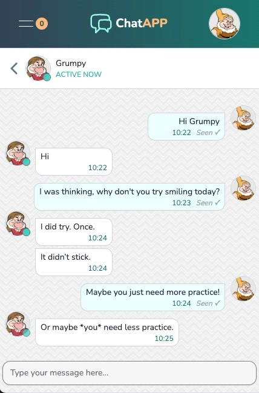
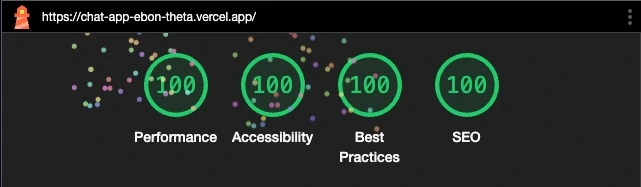

# Chat App

An interactive chat application built with [Next.js](https://nextjs.org). This app allows users to exchange text messages with each other in real-time in a clean and responsive user interface.

## Try the live application here

[https://chat-app-ebon-theta.vercel.app/](https://chat-app-ebon-theta.vercel.app/)

---

## Features

- **User Authentication**: [Auth.js](https://authjs.dev) is used for secure user authentication. OAuth Providers: Google, GitHub and LinkedIn.
- **Real-Time Messaging**: [Pusher](https://pusher.com) is utilised for real-time message delivery.
- **Responsive Design**: Fully optimized for desktop and mobile devices.
- **User Profiles**: View, edit and delete user profiles.
- **Dark Mode**: Seamless light and dark mode support.
- **Full Marks in Chrome Dev LightHouse tests**:

---

## Technologies Used

- **Full Stack Framework**: [Next.js @v15 App Router](https://nextjs.org) with [TypeScript](https://www.typescriptlang.org)
- **Styling**: [Tailwind CSS](https://tailwindcss.com), [HeroUI](https://heroui.com), [ReactIcons](https://react-icons.github.io/react-icons/)
- **Database**: [PostgreSQL](https://www.postgresql.org) with [Prisma](https://www.prisma.io), running on [NEON](https://neon.tech) in production, and [Docker](https://www.docker.com) for local development.
- **Authentication**: [Auth.js @v5(beta)](https://authjs.dev) for secure user authentication.
- **Real-Time Messaging**: [Pusher](https://pusher.com)
- **Front-End State Management**: [Redux RTK](https://redux.js.org) for comprehensive state management.
- **Image processing and storage**: [Cloudinary](https://cloudinary.com) for image storage, [Vercel](https://vercel.com) for deployment.
- **Deployment**: [Vercel](https://vercel.com), [Neon](https://neon.tech) for database hosting.

---

## Credits

### Images

Grumpy: [https://www.disneyclips.com/images4/snowwhite-grumpy.html](https://www.disneyclips.com/images4/snowwhite-grumpy.html)

Happy: [https://www.disneyclips.com/images4/snowwhite-happy.html](https://www.disneyclips.com/images4/snowwhite-happy.html)